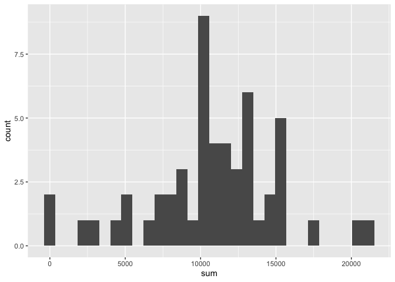
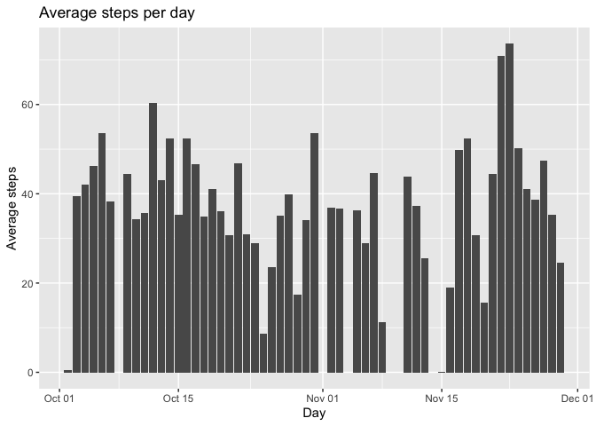
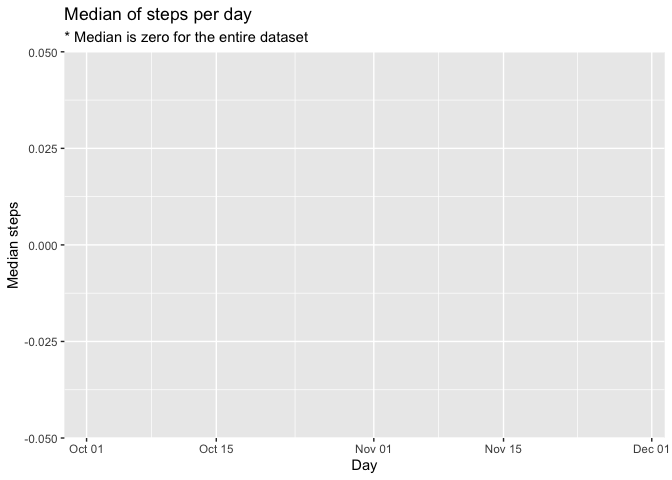
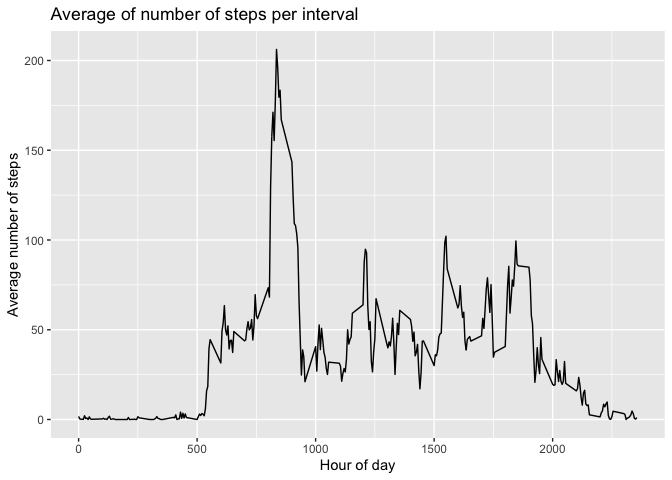
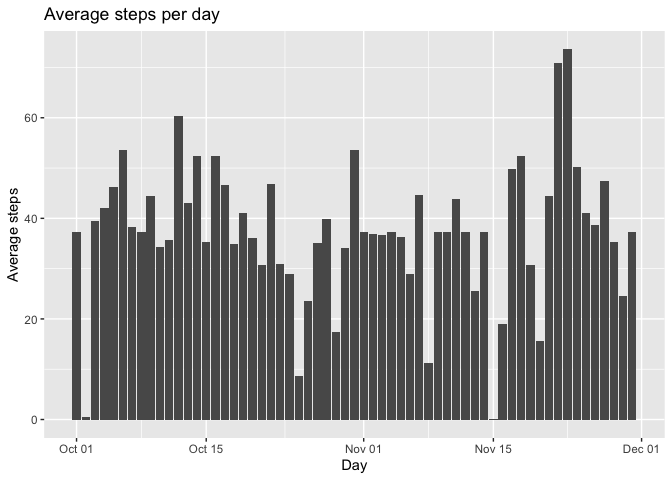
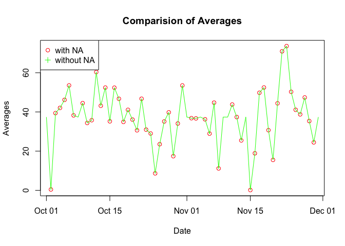
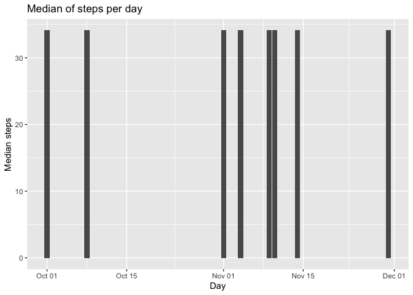
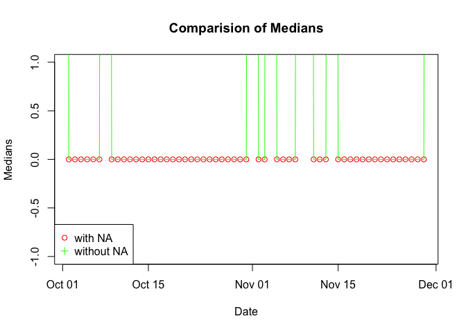
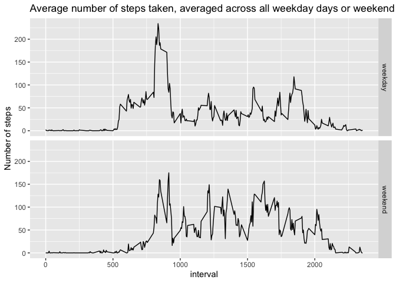

## Loading and preprocessing the data

Loading all the libraries needed

```r
library(readr)
library(dplyr)
library(ggplot2)
```

**1. Code for reading in the dataset and/or processing the data**

Loading the data using `readr` library:

```r
activity <- read_csv("activity.csv")
```


## What is mean total number of steps taken per day?

Calculating the total number of steps per day

```r
sums_per_day <- activity %>%
    filter(!is.na(steps)) %>%
    group_by(date) %>%
    summarise(sum = sum(steps))
```

**2. Histogram of the total number of steps taken each day**

Plotting the histogram of sum of steps per day using `ggplot2`

```r
ggplot(sums_per_day, aes(sum)) + geom_histogram()
```

<!-- -->

**3. Mean and median number of steps taken each day**

Calculating the `mean` and `median` of steps using `dplyr` functions

```r
steps_per_day <- activity %>%
    filter(!is.na(steps)) %>%
    group_by(date) %>%
    summarise(avg = mean(steps), med = median(steps))
```

Plotting average and median of number of steps per day:

```r
ggplot(steps_per_day, aes(date, avg)) +
    geom_col() +
    labs(x = "Day", y = "Average steps",
        title = "Average steps per day")
```

<!-- -->


```r
ggplot(steps_per_day, aes(date, med)) +
    geom_col() +
    labs(x = "Day", y = "Median steps",
        title = "Median of steps per day",
        subtitle = "* Median is zero for the entire dataset")
```

<!-- -->

## What is the average daily activity pattern?
Calculating the average of steps on each time interval

```r
steps_per_interval <- activity %>%
    filter(!is.na(steps)) %>%
    group_by(interval) %>%
    summarise(avg = mean(steps))
```

**4. Mean and median number of steps taken each day**


```r
qplot(interval, avg, data = steps_per_interval, geom = "line",
    xlab = "Hour of day", ylab = "Average number of steps",
    main = "Average of number of steps per interval")
```

<!-- -->

Which 5-minute interval, on average across all the days in the dataset, contains the maximum number of steps?

**5. The 5-minute interval that, on average, contains the maximum number of steps**


```r
max_steps_in_interval <- steps_per_interval %>%
    arrange(desc(avg)) %>%
    top_n(1)
max_steps_in_interval$interval[[1]]
```

```
## [1] 835
```


## Imputing missing values
Calculate and report the total number of missing values in the dataset (i.e. the total number of rows with NAs)

```r
sum(is.na(activity$steps))
```

```
## [1] 2304
```

**6. Code to describe and show a strategy for imputing missing data**

Create a new dataset that is equal to the original dataset but with the missing data filled in.

**Strategy used:** Fill the empty intervals with the average of that given interval.

```r
complete_activity <- mutate(activity, new_steps = steps)

for(i in 1:nrow(complete_activity)) {
  if(is.na(complete_activity[i,]$new_steps)) {
    current_interval <- complete_activity[i,]$interval
    complete_activity[i,]$new_steps = steps_per_interval[steps_per_interval$interval == current_interval,]$avg
  }
}
```

**7. Histogram of the total number of steps taken each day after missing values are imputed **

Make a histogram of the total number of steps taken each day and Calculate and report the mean and median total number of steps taken per day.


```r
complete_sums_per_day <- complete_activity %>%
    filter(!is.na(new_steps)) %>%
    group_by(date) %>%
    summarise(new_sum = sum(new_steps))

par(mfrow = c(1,2))
hist(sums_per_day$sum,
     main = "With NA values",
     xlab = "sum of steps per day - with NAs",
     breaks = 30, ylim = c(0, 20), col = "red")
hist(complete_sums_per_day$new_sum,
     main = "Without NA values",
     xlab = "sum of steps per day - without NAs",
     breaks = 30, ylim = c(0, 20), col = "green")
```

<!-- -->


```r
complete_steps_per_day <- complete_activity %>%
    filter(!is.na(new_steps)) %>%
    group_by(date) %>%
    summarise(new_avg = mean(new_steps), new_med = median(new_steps))
```

Plotting the _new_ `average` and `median` of number of steps per day:

```r
ggplot(complete_steps_per_day, aes(date, new_avg)) +
    geom_col() +
    labs(x = "Day", y = "Average steps",
        title = "Average steps per day")
```

<!-- -->


```r
plot(x = steps_per_day$date, y = steps_per_day$avg, col = "red", pch = 1, main = "Comparision of Averages", xlab = "Date", ylab = "Averages")
lines(x = complete_steps_per_day$date, y = complete_steps_per_day$new_avg, col = "green", pch = 3)
legend("topleft", legend = c("with NA", "without NA"), col = c("red", "green"), pch = c(1, 3))
```

<!-- -->


```r
ggplot(complete_steps_per_day, aes(date, new_med)) +
    geom_col() +
    labs(x = "Day", y = "Median steps",
        title = "Median of steps per day")
```

<!-- -->


```r
plot(x = steps_per_day$date, y = steps_per_day$med, col = "red", pch = 1, main = "Comparision of Medians", xlab = "Date", ylab = "Medians")
lines(x = complete_steps_per_day$date, y = complete_steps_per_day$new_med, col = "green", pch = 3)
legend("bottomleft", legend = c("with NA", "without NA"), col = c("red", "green"), pch = c(1, 3))
```

<!-- -->

**Answers:**

Q: _Do these values differ from the estimates from the first part of the assignment?_

A: Yes


Q: _What is the impact of imputing missing data on the estimates of the total daily number of steps?_

A: The impact on the `averages` is quite small, just a few values were added and the difference is almost not visible. The impact on Median is more relevant. Some values were changed from `0` to `1`.


## Are there differences in activity patterns between weekdays and weekends?

Create a new factor variable in the dataset with two levels – “weekday” and “weekend” indicating whether a given date is a weekday or weekend day.


```r
complete_activity$day_of_week = weekdays(complete_activity$date)
complete_activity$day_of_week.type <- ifelse(complete_activity$day_of_week == "Saturday" | complete_activity$day_of_week == "Sunday", "weekend", "weekday")
complete_activity$day_of_week.type <- factor(complete_activity$day_of_week.type)
```

Make a panel plot containing a time series plot (i.e. type = "l") of the 5-minute interval (x-axis) and the average number of steps taken, averaged across all weekday days or weekend days (y-axis). 


```r
steps_by_week_day <- complete_activity %>%
    filter(!is.na(steps)) %>%
    group_by(interval, day_of_week.type) %>%
    summarise(avg_steps = mean(steps))

ggplot(steps_by_week_day, aes(interval, avg_steps)) +
    geom_line() +
    facet_grid(rows = vars(day_of_week.type)) +
    labs(title = "Average number of steps taken, averaged across all weekday days or weekend",
         y = "Number of steps")
```

<!-- -->
